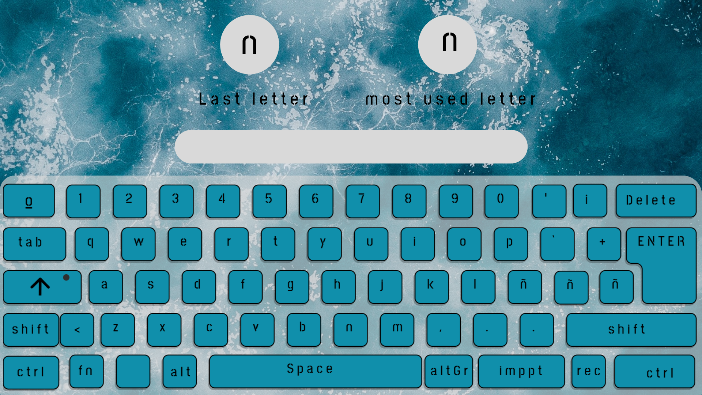
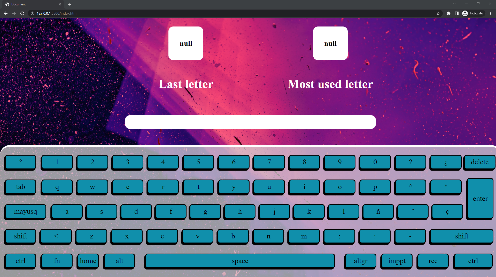
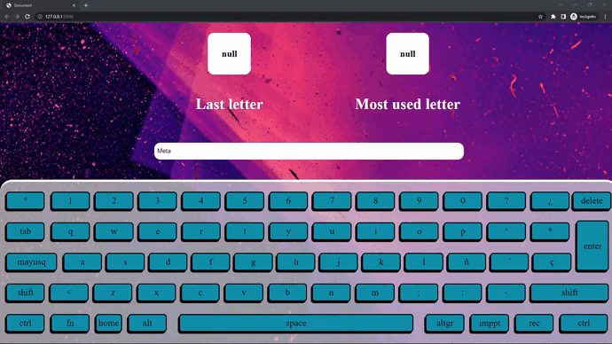

# JavaScript-keyboard

## Inpiracion del proyecto & objetivo

-  El objetivo del proyecto es crear un teclado digital en JavaScript que permita la entrada de texto. 

-  tiene que poder mostrar la ultima letra ingresada y mostrat la tecla que se a presionado mas veces.

El diseño web se ha creado en [Figma](https://www.figma.com/file/kP0SJhf4iDDa9kAzsz1LM1/Github-projects?node-id=0%3A1) por Carlos cruz valencia

## Tecnologias usadas

- Ide
    <!-- visual studio code -->
    <code></code>

- Programas usados
    <!-- figma -->
    <code></code>
- lenguajes/frameworks usados
    <!-- html -->
    <code></code><!-- css -->
    <code></code><!-- sass -->
    <code></code><!-- javascript -->
    <code></img></code>
    <code></img></code>
    
## Vista previa del proyecto

<!-- ``vista no disponible`` -->
</img>
<!-- </img> -->

## Estado del proyecto

|Trabajando en el proyecto|✔️|
| -------------------------- | :----------------: |
|            Web responsive  |      ❌        |
|           Hosting          |   Github-pages |
| Websever app online        |         ✔️    |  
| Dispone de trello          |         ❌    |  
<details>
<summary>⚙️ documentacion del proyecto ⚙️</summary>

1. Creacion de la pagina web en figma
    
1. Maketa de la pagina web en html y css/sass
    
    ``codigo del landing page`` [_landing.scss](assets/styles/sass/layouts/_landing.scss)
    ``codigo del teclado`` [_keys.scss](assets/styles/sass/components/_keys.scss)

2. Se añaden efectos a las teclas del teclado
    
3. Se crea el javascript para detectar la tecla presionada
    ```javascript
    document.addEventListener('keydown', (event) => {
            var name = event.key;
            cosole.log(name);
    }, false);
    ```
    
4. Pasamos el input del keyboard a una lista 
   
    ```javascript
    // lista que almacena las teclas presionadas
    list = [];

    document.addEventListener('keydown', (event) => {
            var name = event.key;
            // agregamos la tecla presionada a la lista
            list.push(name);
            // Eliminamos las , de la lista
            var string = list.join("");
            // pasamos el valor de la lista a el input text
            document.querySelector('input[name="input-text"]').value = string;
    }, false);
    ```
    
5. Se añaden efectos a las teclas del teclado
    ``imagen no disponible``
</details>

<details >
<summary>📁 Estructura de carpetas 📁</summary>

```text
/
└── assets/
│    ├── js/
│    │   ├++ jquery.js "cdn"
│    │   └── app.js
│    └── media/
│    │    └── img
│    └── styles/
│        ├── css/
│        │   ├── main.css
│        │   └── main.css.map
│        └── sass/
│            ├── base/
│            │   └──_settings.scss
│            ├── components/
│            │   └──_keys.scss
│            ├── layouts/
│            │   └──_landing.scss
│            └── main.scss
├── pr-project/
├── index.html
├── Licence
└── README.md
```

</details>


<!-- └── / ├── │ -->


## Licencia

Este proyecto está bajo la Licencia (MIT) - mira el archivo [LICENSE.md](LICENSE.md)  para mas detalles

<!-- ## !codigo temporal¡
## git update code
```shell
git add -A && git commit -a -m \"update\" && git push
```

## sass compiler code
```shell
sass -w --style compressed assets/styles/sass/main.scss assets/styles/css/main.css
``` -->

<!-- ## otros links de interes para hacer la documentacion del proyecto -->

<!-- emojis  -->
<!-- https://tutorialmarkdown.com/emojis -->

<!-- badges/shields -->
<!-- https://naereen.github.io/badges/ -->
<!-- https://github.com/Ileriayo/markdown-badges -->